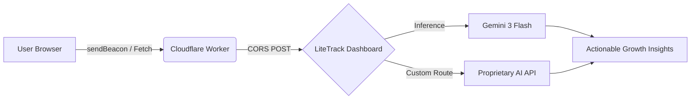

# 🚀 LiteTrack | Open Source Web Analytics

### [📖 GETTING STARTED GUIDE](./GETTING_STARTED.md) • [🛠️ DEPLOYMENT](./GETTING_STARTED.md#step-1-receiver-setup) • [🧠 AI CONFIG](./GETTING_STARTED.md#step-4-ai-insights)

---

LiteTrack is a high-performance, privacy-first web analytics suite designed for the modern edge. It eliminates complex tracking algorithms in favor of a transparent, modular architecture that puts you in control of your data and your intelligence engine.

## 📈 Visual Workflow

> **The Flow:** Data is ingested at the **Network Edge** (Cloudflare), visualized in **Real-Time** on the dashboard, and analyzed by **State-of-the-Art AI** to provide strategic business intelligence.

---

## ✨ Core Features

| 🌓 Dual Theming | 🧠 Modular AI | ⚡ Edge Optimized |
| :--- | :--- | :--- |
| seamless transition between high-contrast **Light** and deep **Slate Dark** modes. | Toggle between **Gemini Built-in** or route data to your own **Custom Inference** endpoints. | Zero-dependency scripts designed for **Cloudflare Workers** and minimal client overhead. |

---

## 📊 Advanced Metrics Engine

LiteTrack now supports industry-standard behavioral metrics out of the box:

- **🟢 Active Now:** Real-time presence detection (5-minute sliding window).
- **⏱️ Load Velocity:** Core Web Vital monitoring (TTI/Interaction timing).
- **🌍 Unique Sources:** Global referrer domain tracking.
- **📉 Bounce Logic:** Automated drop-off detection for landing pages.
- **🔀 Pipeline Score:** Direct home-to-purchase conversion efficiency.

---

## 🛠️ Modular Architecture

LiteTrack is built for the community. We've exposed the **AI Strategy Engine** so you can:
- Use **Gemini 3 Pro** for deep reasoning on complex traffic patterns.
- Connect to an **Internal LLM** via the Custom Endpoint provider.
- Manage multiple **API Keys** via the integrated AI Studio selector.

---

## 🤝 Community & Support

LiteTrack is 100% open source. We believe in analytics that respects user privacy while providing developers with the tools they need to build better products.

- **License:** MIT
- **Contributions:** Pull requests are welcome for new StatCard visualizations or AI Provider adapters.

---

[Return to Dashboard](#)