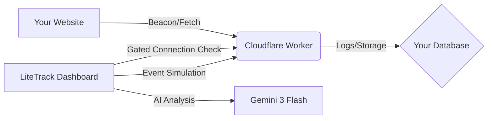

# 🚀 LiteTrack

**A lightweight, privacy-focused web analytics suite featuring a gated event simulator, real-time funnel highlighting, and AI-driven intelligence.**

LiteTrack is a developer-first analytics utility designed for those who value privacy, speed, and simplicity. It provides core web metrics and conversion tracking without the weight of traditional tracking scripts.

---

## 📍 Quick Links

- 📖 **[Getting Started Guide](./GETTING_STARTED.md)**
- 🛠 **[Deployment Template](./App.tsx)** (See Deployment Tab in-app)
- 🤝 **[Contributing](./README.md#contributing)**

---

## 🏗 How It Works

1. **The Website**: Sends tiny, non-blocking JSON payloads (pageviews, custom events) to your endpoint.
2. **The Worker**: A lightweight Cloudflare script receives, validates (CORS), and logs the data.
3. **The Dashboard**: Connect your Worker URL, verify the link with a "Ping", and start simulating user journeys to verify your pipeline.

---

## ✨ Key Features

- **🛡️ Gated Verification:** The simulator only activates after a successful "Handshake" with your Cloudflare Worker, ensuring CORS and endpoints are correctly configured.
- **🧪 Real-time Pipeline Simulator:** Send "Quick Actions" for common funnel steps or design complex payloads in the Advanced JSON Editor.
- **📊 Live Funnel Highlighting:** Visual "ping" indicators in the Funnels tab immediately highlight which conversion step was triggered by incoming simulator traffic.
- **🧠 AI Intelligence:** Uses **Gemini 3 Flash** to parse event history and provide actionable engagement optimizations and performance scoring.
- **☁️ Edge-Ready Snippets:** Ready-to-use JS snippets optimized for the Cloudflare network (SendBeacon, Fetch with keepalive, and XHR).

---

## 🚀 Getting Started

1. **Deploy your Worker:** Copy the receiver template from the **Deployment** tab.
2. **Connect & Verify:** Paste your Worker URL in the **Integration** tab and click **Establish Connection**.
3. **Simulate & Trace:** Use the Funnel Triggers to send events and watch the **Funnels** tab update in real-time with live highlighting.

👉 **[Read the Step-by-Step Walkthrough](./GETTING_STARTED.md)**

---

## 🤝 Contributing

We love community contributions! 
1. Fork the Project.
2. Create your Feature Branch (`git checkout -b feature/AmazingFeature`).
3. Commit your Changes.
4. Push to the Branch and open a Pull Request.

## 📄 License

Distributed under the MIT License. See `LICENSE` for more information.

---

  <i>Built for the community. Powered by simplicity.</i>

