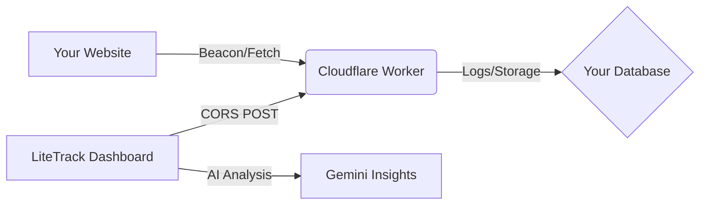

# 🚀 LiteTrack

**A lightweight, privacy-focused web analytics suite featuring real-time event simulation, AI-driven traffic insights, and seamless Cloudflare Worker integration.**

LiteTrack is a developer-first analytics utility designed for those who value privacy, speed, and simplicity. It provides core web metrics without the weight of traditional tracking scripts.

---

## 📍 Quick Links

- 📖 **[Getting Started Guide](./GETTING_STARTED.md)**
- 🛠 **[Deployment Template](./App.tsx)** (See Deployment Tab)
- 🤝 **[Contributing](./README.md#contributing)**

---

## 🏗 How It Works

1. **The Website**: Sends small, non-blocking JSON payloads to your endpoint.
2. **The Worker**: A tiny Cloudflare script receives, validates, and stores the data.
3. **The Dashboard**: You use the LiteTrack UI to simulate traffic, verify your worker, and get AI insights.

---

## ✨ Key Features

- **🛡️ Privacy-First Design:** Zero cookies, zero bloated scripts. GDPR/CCPA friendly by default.
- **🧪 Real-time Simulator:** Verify your data pipeline immediately using the built-in Event Designer.
- **🧠 AI Intelligence:** Uses Gemini 3 Flash to analyze traffic patterns and suggest engagement optimizations.
- **☁️ Cloudflare Native:** Optimized specifically for the Cloudflare edge network.
- **🔌 Zero-Config Snippets:** Ready-to-use JS snippets for Beacon API, modern Fetch, and Legacy XHR.

---

## 🚀 Getting Started

Ready to take control of your data? Follow our step-by-step walkthrough:

👉 **[Read the Full Getting Started Guide](./GETTING_STARTED.md)**

### Short Version:
1. **Deploy your Worker:** Copy the template from the **Deployment** tab.
2. **Configure Dashboard:** Paste your Worker URL in the **Integration** tab.
3. **Simulate Traffic:** Click "Immediate Ping" to see your data flow in real-time.

---

## 🛠 Tech Stack

- **Frontend:** React 19, Tailwind CSS
- **Visualization:** Recharts
- **Intelligence:** Google Gemini API
- **Infrastructure:** Cloudflare Workers (Receiver)

---

## 🤝 Contributing

We love community contributions! 
1. Fork the Project.
2. Create your Feature Branch (`git checkout -b feature/AmazingFeature`).
3. Commit your Changes (`git commit -m 'Add some AmazingFeature'`).
4. Push to the Branch (`git push origin feature/AmazingFeature`).
5. Open a Pull Request.

## 📄 License

Distributed under the MIT License. See `LICENSE` for more information.

---

  <i>Built for the community. Powered by simplicity.</i>

